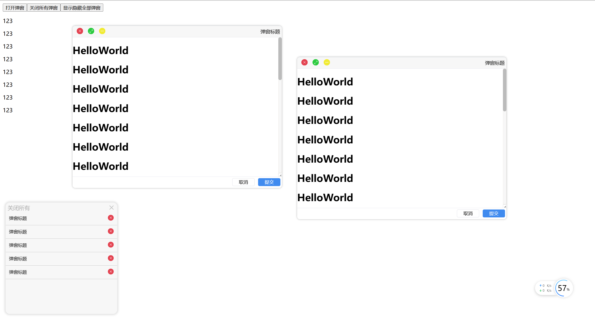

## 分支介绍

- main ： 会到这个分支上进行打包，功能开发完成并且测试通过才会合并到该分支；
- 开发分支：除了main分支之外的都是开发分支，开发一个功能会单独新签分支，你会看到很多分支，没错是我懒得删了；

# lx-modal

## 背景

Element Plus 的dialog太丑，而且也不好用，我不服！就想自己写一个，也不去封装它的了，自己纯手撸！不依赖其他任何第三方包。

**函数式组件：**`打开弹窗，我只需要一个方法。`

## 预览

1. 弹窗头部提供两种风格，默认windows风格，支持自定义；
2. 弹窗功能包括拖动、拖拉改变宽高、遮罩、关闭、最小化、最大化、窗口化等功能；
3. 悬浮球可以对打开的弹窗进行管理；

伪Mac风格：




Windows风格：


## 技术栈

- Vue 3 + TypeScript + Vite + javascript + scss 

用vue3进行构建，没有引入其余任何第三方依赖，npm包体积总共35kb（version 0.31.0），按需引入只使用弹窗体积会更小；

## 安装

[npm地址](https://www.npmjs.com/package/lx-modal?activeTab=readme)

安装依赖：

```bash
npm i lx-modal
```

引入样式：

```js
// main.ts
import 'lx-modal/style.css';

const app = createApp(App);
app.mount('#app');
```

# 使用教程

## hello world

```vue
<template>
	<button @click="addPersonFun">新增</button>
</template>
<script setup lang="ts">
import AddPersonModal from './components/AddPersonModal/index.vue';
// 1、按需引入
import { openModal } from 'lx-modal';

function addPersonFun() {
    // 2、调用openModal打开弹窗，业务组件AddPersonModal为弹窗内容
	openModal(AddPersonModal, {
		width: 600,
		height: 400,
		modalTitle: '添加人员',
	}).then((_data: any) => {
		console.log('==打开成功==', data);
	});
}
</script>
```

## 打开弹窗

```ts
import { openModal } from 'lx-modal';
```

openModal：打开的弹窗的函数，返回promise，接受两个参数，第一个是弹窗的内容组件（业务组件），会被渲染到弹窗内；第二个配置对象，即传递给业务组件的prop。

```ts
// 配置对象的属性如下
defineProps({
   	// 能否通过遮罩关闭弹窗
	maskClosable: {
		type: Boolean,
		default: true,
	},
	// 遮罩
	modalMaskDisplay: {
		type: Boolean,
		default: false,
	},
    // 弹窗头部自定义组件，不传即默认windows风格
	modalHeaderComponent: {
		type: Object,
		default: () => HeaderWin,
	},
	// 是否使用自定义的业务footer，底部按钮组件使用自定义写到业务组件内则传入true
	isDiyFooter: {
		type: Boolean,
		default: false,
	},
    // 弹窗底部按钮组件，暂建议自定义按钮写到业务组件内
	modalFooterComponent: {
		type: Object,
		default: () => Footer,
	},
    modalTitle: {
		type: String,
		default: '🐽lx-modal',
	},
	width: {
		type: Number,
		default: 500,
	},
	height: {
		type: Number,
		default: 250,
	},
	zIndex: {
		type: String,
		default: '1000',
	},
	// 弹窗尺寸可拖动
	resize: {
		type: Boolean,
		default: true,
	},
	// 提交前的狗子函数
	submitModalBeforeEvent: {
		type: Function,
		default: null,
	},
	// 提交后的狗子函数
	submitModalAfterEvent: {
		type: Function,
		default: null,
	},
	// 业务数据
	propsData: {
		type: Object,
		default: () => ({}),
	},
});
```

## 弹窗头部自定义

类名样式都自定义，你只需要将下边的模板的事件绑定正确即可。

```vue
<template>
	<div
		class="header-diy"
		:ref="scope.draggableDOMPointRef"
		:id="scope.draggableDOMPointID"
		draggable="true"
		@dragstart="scope.onDragstart"
		@drop="scope.onDrop"
	>
		<div class="modal-header-left">
			<span class="modal-header-left-title" v-text="scope.modalTitle"></span>
		</div>
		<div class="modal-header-right">
			<!-- 最小化 -->
			<div class="modal-header-right-btn" @click="scope.onClickMin">
			</div>
			<!-- 窗口化 -->
			<div class="modal-header-right-btn" @click="scope.onClickToggleFullScreen">
			</div>
			<!-- 关闭 -->
			<div class="modal-header-right-btn" @click="scope.onClickClose">
			</div>
		</div>
	</div>
</template>
<script setup lang="ts">
defineOptions({
	name: 'HeaderDiy',
});
defineProps({
	scope: {
		type: Object,
		default: () => ({
            draggableDOMPointRef: '',
			isFullScreen: false,
			modalTitle: '',
			draggableDOMPointID: '',
			onDragstart: () => {},
			onDrop: () => {},
			onClickMin: () => {},
			onClickToggleFullScreen: () => {},
			onClickClose: () => {},
        }),
	},
});
</script>
<style lang="scss" scoped>
</style>
```


## 弹窗底部自定义

在实际业务场景中，弹窗内有表单，相应的按钮可能有保存、提交、存草稿、驳回等等相关按钮，弹窗默认的两个按钮肯定是不满足需求的，所以在弹窗内部允许自定弹窗底部按钮显得lx-modal更加贴合实际开发场景。

- 方案一：写在弹窗业务组件内，通过样式控制

在组件内部已经在modal-diy-body弹窗内容做了处理，所以你要注意的就是注意两个根元素的层级关系和类名

```vue
<template>
	<div class="modal-diy-content">
		<h1>HelloWorld</h1>
		<h1>HelloWorld</h1>
		<h1>HelloWorld</h1>
		<h1>HelloWorld</h1>
		<h1>HelloWorld</h1>
	</div>
	<div class="modal-diy-footer">
		<button @click="cancelFun">取消</button>
		<button @click="cancelFun">保存</button>
	</div>
</template>

<script lang="ts" setup>
import { getCurrentInstance } from 'vue';

const Instance = getCurrentInstance();
function cancelFun() {
	Instance?.appContext.config.globalProperties.unmountModal();
}
</script>

<style scoped lang="scss">
.modal-diy-footer {
	padding: 4px;
	text-align: right;
}
.modal-body.scroll-container.modal-diy-body {
	.modal-diy-footer {
		height: 50px;
	}
	.modal-diy-content {
		margin-bottom: 100px;
	}
}
</style>
```

方案二：openModal时传入底部组件

```js
    import MyFooter from './MyFooter.vue';

    openModal(Helloworld, {
		modalFooterComponent: MyFooter
	}).then((_data: any) => {
		console.log('==打开成功==', data);
	});
```


## 关闭弹窗

在当前实例全局属性上有个一个关闭弹窗的unmountModal方法，这个方法会卸载当前组件

```ts
const Instance = getCurrentInstance();
Instance?.appContext.config.globalProperties.unmountModal();
```

可以一键关闭所有弹窗：

```ts
import {  closeAllModal } from 'lx-modal';

closeAllModal()
```

## 打开的所有弹窗

保持了响应式，打开的所有弹窗通过ref包裹一个Map存储起来，可能的运用场景在最大弹窗数........

```ts
import { ModalInstanceMap } from 'lx-modal';

console.log(ModalInstanceMap.value)
```


## 悬浮球

如果是单纯的使用弹窗，悬浮球貌似也没有那么的必要，但如果你想将lx-modal集成进你的系统中，那么悬浮球是一个提升用户体验的不错选择。

```vue
<template>
	<lx-modal-box v-model="ModalInstanceMap"> </lx-modal-box>
</template>

<script setup lang="ts"> 
import {  LxModalBox, ModalInstanceMap } from 'lx-modal';
</script> 
```


# 看我看我

因为精力有限，但是有时间、有需求驱动就会继续更新，当然也欢迎各位大佬能够给出宝贵意见（最好是提pr嘻嘻）~


